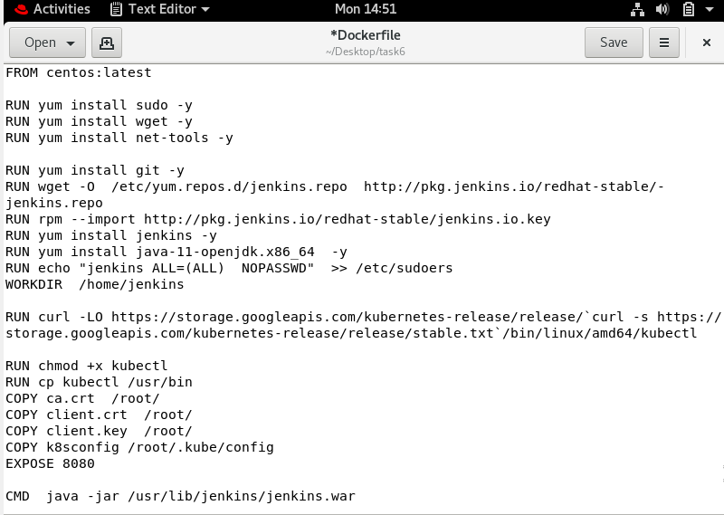

#  TASK OVERVIEW

Perform third task with the help of Jenkins coding file
( called as jenkinsfile approach ) and perform the with
following phases:

1. Create container image that’s has Jenkins installed
   using dockerfile  Or You can use the Jenkins Server 
   on RHEL 8/7
2.  When we launch this image, it should automatically 
    starts Jenkins service in the container.
3.  Create a job chain of job1, job2, job3 and  job4 using
    build pipeline plugin in Jenkins 
4.  Job2 ( Seed Job ) : Pull  the Github repo automatically 
    when some developers push repo to Github.
5. Further on jobs should be pipeline using written code  
   using Groovy language by the developer
6. Job1 :  
    1. By looking at the code or program file, Jenkins should
       automatically start the respective language interpreter 
       installed image container to deploy code on top of 
       Kubernetes ( eg. If code is of  PHP, then Jenkins should 
       start the container that has PHP already installed )
    2.  Expose your pod so that testing team could perform the
        testing on the pod
    3. Make the data to remain persistent using PVC ( If server 
       collects some data like logs, other user information )
7.  Job3 : Test your app if it  is working or not.
8.  Job4 : if app is not working , then send email to developer 
           with error messages and redeploy the application after 
           code is being edited by the developer
           
 In this task we are using jenkins groovy language code 
 for our jenkins jobs to execute
 
 # Jenkins Groovy Language
 Apache Groovy is a powerful, multi-faceted language for the
 Java platform. Jenkins-CI is the leading open source process
 automation and integration server used by development teams
 throughout the world. In this presentation, I discuss how Groovy 
 (the native scripting language of Jenkins-CI) can be used throughout
 the Jenkins ecosystem to enhance and extend Jenkins. I highlight 
 specific examples that demonstrate how Jenkins can be used as a 
 portal for executing Groovy scripts via a web interface and how
 Groovy-based plugins can enhance Jenkins with rich, interactive 
 interfaces and consistent but dynamic build reports.
 
 
 
 
 # Step 1:
 First step of the task is to create a dockerfile which has jenkins 
 installed with its yum repo configured with some required components 
 to run commands inside our centos container.In jenkins we have to 
 provide root or admin power which is not bydefault provided.With this 
 we have to expose jenkins with its port 8080. 
 
 After creation building the dockerfile with the command 
 
    docker build -t task6:v6
    
 Running the container image which is created after building and 
 exposing it at the same time.
      
      docker run -it -p 2424:8080 --name OS6 task6:v6
 
 Also creating a docker file  that will be dowloaded by the jenkins 
 job for launching the language(only HTML is used here) interpreter.
  
         
         FROM centos:latest
         RUN yum install sudo -y
         RUN yum install httpd -y
         COPY *.html /var/www/html/
         CMD /usr/sbin/httpd -DFOREGROUND && /dev/bash
      
      
 # Step 2:
 Creating deployment for the server. In this task I have 
 used deployment for html only, we also use other languages
 for the same.
 
Creating persistent volume fot the deployment.  
 
 
        apiVersion: v1
        kind: PersistentVolume
        metadata:
          name: html-pv
          labels:
            type: local
        spec:
          storageClassName: manual
          capacity:
            storage: 3Gi
          accessModes:
            - ReadWriteOnce
          hostPath:
            path: "/mnt/sdr/data/website"
            
 Commnd that will be used to create persistent volume:
    
        kubectl create -f htmlpv.yml
 
 
we have to create PVC for storing permanent data
 
     apiVersion: v1
     kind: PersistentVolumeClaim
     metadata:
       name: pvc-html
     spec:
       storageClassName: manual
       accessModes:
         - ReadWriteOnce
       resources:
         requests:
           storage: 3Gi
        
   Command that will be used to create pvc:
     
         kubectl create -f pvc-storage.yml
         
  Exposing the deployment with the service 
    
      apiVersion: v1
      kind: Service
      metadata:
        name: expose
      spec:
        type: NodePort
        selector: 
        app: webserver
        ports:
          - port: 80
            targetPort: 80
            nodePort: 2424
  
  FOR exposing the deployment we will use the command:
  
      kubectl create expose -f expose-html.yml
      
  After creating pvc and service creating the deployment file:   
  
         apiVersion: apps/v1
         kind: Deployment
         metadata:
           name: web-deployment
             labels:
               app: web
         spec:
           replicas: 3
             selector:
               matchLabels:
                 app: server
             template:
               metadata:
                 name: web-deployment
                 labels:
                   app: server
               spec:
                 containers:
                 - name: deployment-server
                   image: yashu-web:v2
                   imagePullPolicy: IfNotPresent
            
                 volumeMounts:
                 - mountPath: "/var/log/httpd"
                   name: pvc-storage
               volumes:
               - name: pvc-storage
                 persistentVolumeClaim:
                   claimname: pvc-html    
                   
                   
 Deployment command that will be used :
 
      kubectl create -f deploy.yml
      
 # Step 3:
   
   Now we have to create jenkins job for downloading the github code.
   This job will eheck the extension of the code and the same image 
   will be pushed to dockerhub repository.
   
   We don't have to do the things directly but have to use the groovy 
   code for this.
   
        job("job1-github") {
        steps {
        scm {
              github("yash-ops22/task6", "master")
            }
        triggers {
              scm("* * * * *")
            }
        shell("sudo cp -rvf * /groovy")
        if(shell("ls /groovy/ | grep html")) {
              dockerBuilderPublisher {
                    dockerFileDirectory("/groovy/")
                    cloud("docker")
        tagsString("server:v1")
                    pushOnSuccess(true)

                    fromRegistry {
                          url("yash-ops22")
                          credentialsId("xxxxxxxx-xxxx-xxxx-xxxx-xxxxxxxxxxxx")
                    }
                    pushCredentialsId("xxxxxxxx-xxxx-xxxx-xxxx-xxxxxxxxxxxx")
                    cleanImages(false)
                    cleanupWithJenkinsJobDelete(false)
                    noCache(false)
                    pull(true)
              }
        }
        else {
              dockerBuilderPublisher {
                    dockerFileDirectory("/groovy/")
                    cloud("docker")
        tagsString("web-html:v1")
                    pushOnSuccess(true)

                    fromRegistry {
                          url("yash-ops22")
                          credentialsId("xxxxxxxx-xxxx-xxxx-xxxx-xxxxxxxxxxxx")
                    }
                    pushCredentialsId("xxxxxxxx-xxxx-xxxx-xxxx-xxxxxxxxxxxx")
                    cleanImages(false)
                    cleanupWithJenkinsJobDelete(false)
                    noCache(false)
                    pull(true)
              }
        }
        }
        }
   
 # Step 4:
 
 Next we have to create another jenkins job for the deployment of pods 
 from the yml code.
 
        job("pod-deploy") {

      triggers {
        upstream {
          upstreamProjects("job1-github")
          threshold("SUCCESS")
        }  
      }

      steps {
        if(shell("ls /groovy | grep html")) {

          shell("if sudo kubectl get pv html-pv; then if sudo kubectl get pvc  pvc-html; then echo " PVC alreaday there"; else kubectl create -f pvc-storage.yml; fi; else sudo kubectl create -f htmlpv.yml; sudo kubectl create -f pvc-storage.yml; fi; if sudo kubectl get deployments web-deployment ; then sudo kubectl rollout restart deployment/web-deployment ; sudo kubectl rollout status deployment/web-deployment; else sudo kubectl create -f deploy.yml; sudo kubectl create -f expose-html.yml; sudo kubectl get all; fi")       

      }

        
      }
    }
 
 # Step 5:
 
 Then we have to check for the pods if they are running or not.
 For this we have to configure our email in jenkins. If their 
 is any error in the deployment this job will send an mail to
 the mentioned email.
 
       job("Testing") {

    steps {

        shell('export status=$(curl -siw "%{http_code}" -o /dev/null                     192.168.99.100:2424); if [ $status -eq 200 ]; then exit 0; else python3           mail.py; exit 1; fi')
      }
    }
 
 
 After checking the mail from the jenkins we can fix them.
 
 
 
 This is all about the Task!!
 
 
 
 
 
 
 
 
 
 
